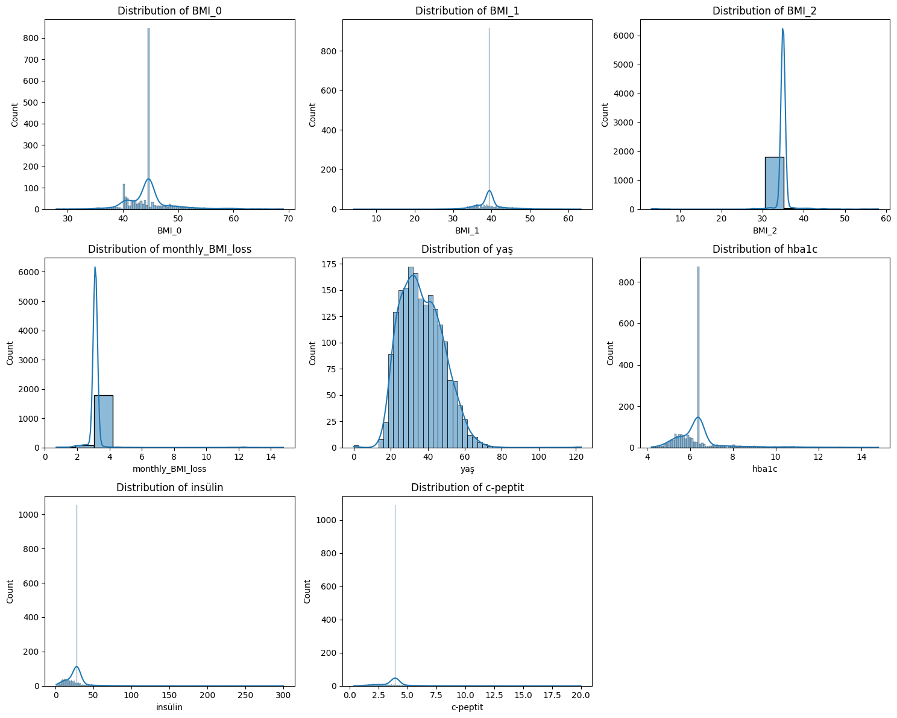
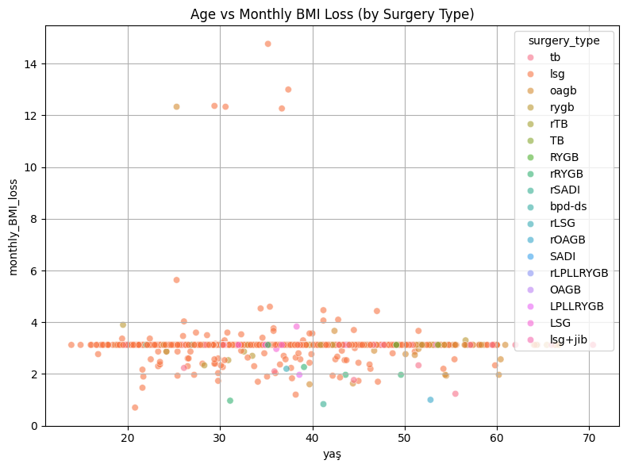
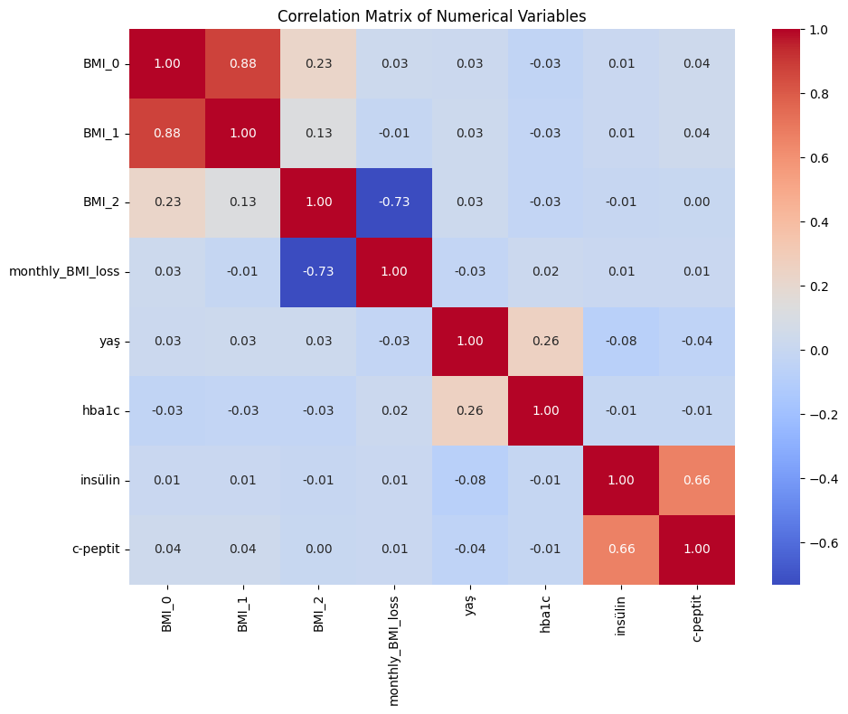
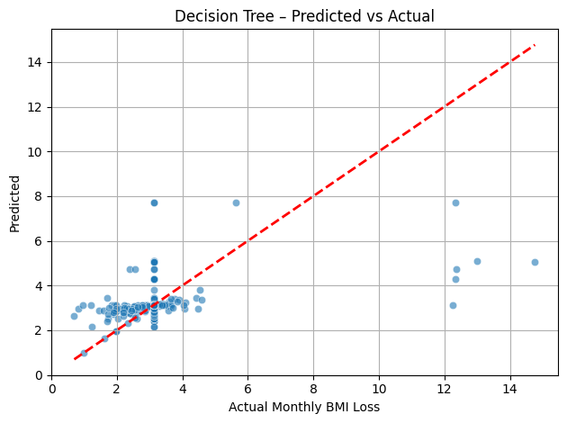
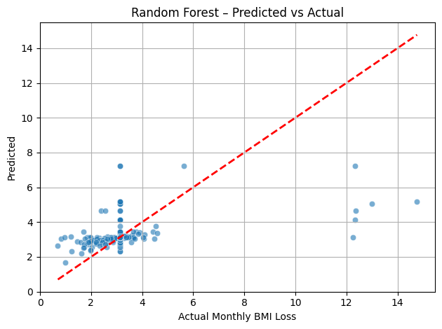

# DSA210 Term Project – BMI Prediction Based on Age and Surgery Type

## Project Title

**BMI Prediction Using Age and Surgery Type**

---

## Motivation

Every patient’s journey through obesity and bariatric surgery is unique. While the procedures aim to reduce weight and improve quality of life, the degree of success can vary greatly from person to person. What makes one patient lose weight faster than another? Could factors like age or the type of surgery help us predict these differences in weight loss?
Understanding these patterns is not only clinically valuable but also emotionally impactful. For a patient preparing for surgery, knowing what to expect based on others' data can provide reassurance and improve mental readiness. For healthcare professionals, insights from such analysis can inform better, data-driven decisions and enable more personalized care plans. This project was inspired by a desire to bring clarity to those questions, to turn numbers into insights, and most importantly, to use data to support patients on one of the most challenging journeys of their lives.

---

## Project Goal

The main goal of this project is to analyze the relationship between patient age, surgery type, and their monthly BMI change after undergoing bariatric surgery. Using real-world clinical data, the project aims to:

* Identify trends and correlations between these factors.

* Quantify how much of the BMI change can be explained by age and surgery type.

* Build predictive models that estimate how much weight a patient might lose per month, depending on their characteristics.

By combining exploratory data analysis, statistical tests, and machine learning techniques, the project seeks to provide actionable insights that can help both patients and clinicians make more informed, confident decisions in the context of obesity treatment.

---

## Data Sources and Preprocessing

* **Data Source 1:** `ayaybmi.csv` (BMI values and surgery types)
* **Data Source 2:** `TAKİP 22.01.2025 SPSSE HAZIRLIK.csv` (Age and clinical values)
* Variables used: `Age`, `Surgery_Type`, `BMI_0`, `BMI_1`, `BMI_2`, `monthly_BMI_loss`
* Cleaned dataset: Removed or imputed missing values, converted comma decimals to float, merged datasets on patient index.

---

## Files in This Repo

* `analysis.ipynb`: EDA, ML, and statistical testing
* `README.md`: This project summary
* `data/ayaybmi.csv`: BMI dataset
* `data/TAKİP 22.01.2025 SPSSE HAZIRLIK.csv`: Demographic and clinical dataset

---
## Hypothesis

Null Hypothesis (H₀):
There is no significant relationship between a patient's age or surgery type and the amount of monthly BMI loss following bariatric surgery.
→ Any variation in BMI change is due to random chance or other unmeasured factors.

Alternative Hypothesis (H₁):
There is a significant relationship between a patient's age and/or surgery type and the amount of monthly BMI loss.
→ Age and surgery type influence how much weight a patient loses post-operatively on a monthly basis.

---

## Exploratory Data Analysis

### Univariate Analysis

A series of histograms and KDE plots were used to inspect distributions of numerical variables.

* **Observation:** `monthly_BMI_loss` showed right-skewness; `yaş` (age) displayed a normal-like distribution.

* Monthly BMI Loss: Most patients lost around 2.5–4 units of BMI per month, but a few had much higher losses. This right-skewed pattern suggests that while typical outcomes are moderate, some patients respond very strongly to surgery.

* Age: Age followed a near-normal distribution, with most patients between 30 and 60 years old. This aligns with what we’d expect, as bariatric surgery is most common in middle adulthood.

* BMI (Before/After): As expected, BMI decreased from the first to the last measurement. The spikes in the graphs suggest values might have been rounded in the records.

* Clinical Variables (hba1c, insulin, c-peptit): These showed a lot more variation. Some outliers may reflect patients with more complex metabolic issues like diabetes.

---

### Bivariate Analysis

A scatter plot was used to analyze the relationship between age and monthly BMI loss.

* **Observation:** 
There wasn't a clear linear trend between age and BMI loss, but when grouped by surgery type, slight differences emerged. Some surgeries seemed to result in more consistent BMI loss across age, while others had more variation. So while age alone doesn't predict much, it might interact subtly with the type of surgery.

---

### Multivariate Analysis

A correlation heatmap was generated for all numeric variables.

* **Key Finding:** 

The strongest relationship was a negative correlation between BMI_2 and monthly_BMI_loss, which makes sense: lower BMI at the end = more weight lost.

Age showed only a weak correlation with BMI change, reaffirming earlier observations.
This tells us that while surgery clearly affects BMI, age plays a more minor role in predicting outcomes.

---

## Machine Learning Models and Performance

Three regression models were applied using `age` as the sole feature to predict `monthly_BMI_loss`. The performance metrics evaluated were MAE (Mean Absolute Error), RMSE (Root Mean Squared Error), and R² (coefficient of determination).

| Model             | MAE    | RMSE   | R²      |
| ----------------- | ------ | ------ | ------- |
| Linear Regression | 0.0882 | 0.5405 | 0.0003  |
| Decision Tree     | 0.1405 | 0.6100 | -0.2737 |
| Random Forest     | 0.1396 | 0.5951 | -0.2122 |

### Interpretation of Results

* **Linear Regression** performed slightly better than others but still explained very little variance (R² \~ 0.0003).
* Both **Decision Tree** and **Random Forest** models showed negative R² scores, meaning they performed worse than a horizontal mean predictor.
* **Conclusion:** The models were unable to effectively learn a predictive function from age alone. Other variables or better feature engineering might be needed.

### Predicted vs Actual Plots

Below are scatter plots comparing actual BMI loss with predicted values for each model. The dashed red line indicates perfect prediction.

**Linear Regression**

This simple model performed best overall with the highest R² (~0.0003) and lowest error rates. While still weak in predictive power, it's the most reliable option when using age alone. Its transparency makes it easy to understand.

**Decision Tree**

The decision tree overfit the data and had poor generalization. The negative R² suggests it captured noise more than signal. With more features or data, it might improve, but for now, it’s not very useful on its own.

**Random Forest**

Random Forest slightly outperformed the decision tree, but still showed a negative R², indicating weak predictive performance. It usually excels in complex data, but here, with only one feature - age - (since each surgery type is to be looked on their own), its strengths couldn't shine.

---

## Statistical Testing

To complement ML models, statistical testing was conducted to check whether age groups significantly differ in terms of BMI loss.

### Age Group Analysis (ANOVA)

Patients were grouped by age into three bins:

* Young (0–40)
* Middle-aged (41–60)
* Older (61–100)

A one-way ANOVA test was conducted.

* **F-statistic:** 1.80
* **p-value:** 0.165

**Interpretation:** No significant difference was found between age groups (p > 0.05). This aligns with the poor performance of ML models and supports the conclusion that age alone may not significantly predict monthly BMI loss.

---

## Conclusion

Unfortunately, all three ML models performed poorly when using age as the only input variable. The R² scores were close to or below zero, indicating that the models couldn't capture meaningful patterns in the data. Even the best performer, Linear Regression, explained virtually none of the variance in monthly BMI loss.

Statistical analysis supported this result. The ANOVA test comparing age groups showed no significant differences in BMI change across younger, middle-aged, and older patients (p-value > 0.05).

What does this mean?
Age, on its own, doesn't seem to explain why some patients lose more weight than others after surgery. This implies that other factors —perhaps metabolic data, lifestyle habits, or even psychological factors— play a more important role in BMI outcomes.

So while this analysis didn't produce a strong predictive model, it provided a valuable insight: single-variable predictions are not enough for understanding complex medical outcomes like weight loss. 
---

## Future Work

* Include additional predictors such as initial BMI, clinical indicators, gender, and behavioral factors.
* Apply feature engineering techniques to improve predictive power.
* Explore interaction effects between age, surgery type, and other variables.

After all that this code would be ready to estimate (or predict) the monthly BMI loss of each patient.

  
  
