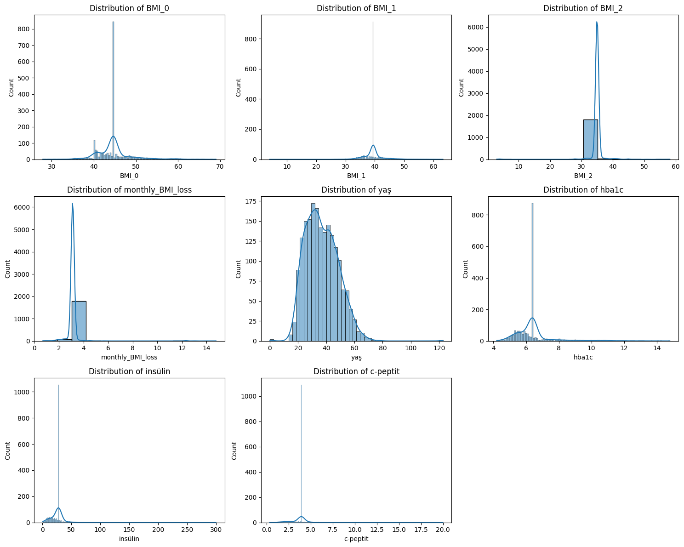
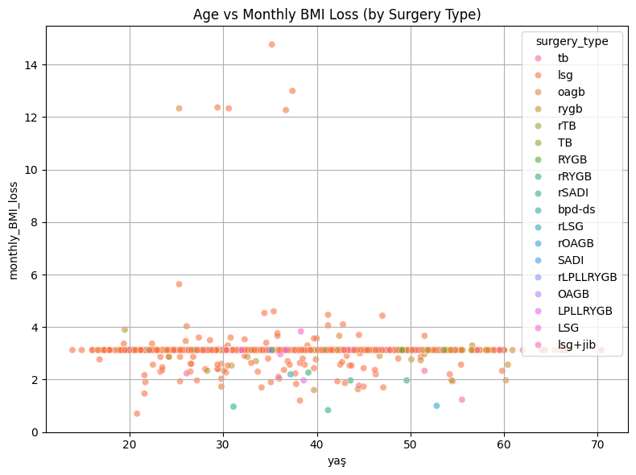

# DSA210 Term Project – BMI Prediction Based on Age and Surgery Type

## Author: Göktuğ Kırkıl – Sabancı University

---

## Project Title

**BMI Prediction Using Age and Surgery Type**

---

## Motivation

Bariatric surgery outcomes can differ widely based on patient characteristics. Understanding how variables like age and surgery type affect Body Mass Index (BMI) change can provide insights into expected outcomes and guide personalized interventions.

---

## Project Goal

To analyze how age and surgery type relate to post-operative BMI changes and build predictive models for monthly BMI reduction using multiple machine learning techniques.

---

## Data Sources and Preprocessing

* **Data Source 1:** `ayaybmi.csv` (BMI values and surgery types)
* **Data Source 2:** `TAKİP 22.01.2025 SPSSE HAZIRLIK.csv` (Age and clinical values)
* Variables used: `Age`, `Surgery_Type`, `BMI_0`, `BMI_1`, `BMI_2`, `monthly_BMI_loss`
* Cleaned dataset: Removed or imputed missing values, converted comma decimals to float, merged datasets on patient index.

---

## Exploratory Data Analysis

### Univariate Analysis

A series of histograms and KDE plots were used to inspect distributions of numerical variables.

* **Observation:** `monthly_BMI_loss` showed right-skewness; `yaş` (age) displayed a normal-like distribution.

---

### Bivariate Analysis

A scatter plot was used to analyze the relationship between age and monthly BMI loss.

* **Observation:** There's no strong linear relationship between age and BMI loss, but different surgery types showed slightly different patterns.

---

### Multivariate Analysis

A correlation heatmap was generated for all numeric variables.

* **Key Finding:** Strongest inverse correlation was between BMI\_2 and monthly\_BMI\_loss, indicating expected weight loss impact. Age had a weak correlation with BMI loss.

!\[Correlation Heatmap]\(Correlation Matrix.png)

---

## Machine Learning Models and Performance

Three regression models were applied using `age` as the sole feature to predict `monthly_BMI_loss`. The performance metrics evaluated were MAE (Mean Absolute Error), RMSE (Root Mean Squared Error), and R² (coefficient of determination).

| Model             | MAE    | RMSE   | R²      |
| ----------------- | ------ | ------ | ------- |
| Linear Regression | 0.0882 | 0.5405 | 0.0003  |
| Decision Tree     | 0.1405 | 0.6100 | -0.2737 |
| Random Forest     | 0.1396 | 0.5951 | -0.2122 |

### Interpretation of Results

* **Linear Regression** performed slightly better than others but still explained very little variance (R² \~ 0.0003).
* Both **Decision Tree** and **Random Forest** models showed negative R² scores, meaning they performed worse than a horizontal mean predictor.
* **Conclusion:** The models were unable to effectively learn a predictive function from age alone. Other variables or better feature engineering might be needed.

### Predicted vs Actual Plots

Below are scatter plots comparing actual BMI loss with predicted values for each model. The dashed red line indicates perfect prediction.

**Linear Regression**
!\[Linear Regression]\(Linear Regression .png)

**Decision Tree**
!\[Decision Tree]\(Decision Tree.png)

**Random Forest**
!\[Random Forest]\(Random Forest.png)

---

## Statistical Testing

To complement ML models, statistical testing was conducted to check whether age groups significantly differ in terms of BMI loss.

### Age Group Analysis (ANOVA)

Patients were grouped by age into three bins:

* Young (0–40)
* Middle-aged (41–60)
* Older (61–100)

A one-way ANOVA test was conducted.

* **F-statistic:** 1.80
* **p-value:** 0.165

**Interpretation:** No significant difference was found between age groups (p > 0.05). This aligns with the poor performance of ML models and supports the conclusion that age alone may not significantly predict monthly BMI loss.

---

## Conclusion

* ML models using only age as a predictor failed to provide reliable predictions.
* There is no significant statistical difference in BMI loss across age groups.
* This suggests that BMI change is influenced by more complex interactions or other variables not included in this analysis.

---

## Files in This Repo

* `analysis.ipynb`: EDA, ML, and statistical testing
* `README.md`: This project summary
* `data/ayaybmi.csv`: BMI dataset
* `data/...csv`: Demographic and clinical dataset

---

## Future Work

* Include additional predictors such as initial BMI, clinical indicators, gender, and behavioral factors.
* Apply feature engineering techniques to improve predictive power.
* Explore interaction effects between age, surgery type, and other variables.

